<div align="center">

# agony's dotfiles

**Arch Linux on an HP Victus. niri, translucent everything, and one keybind that re-themes the whole desktop from a wallpaper.**

    

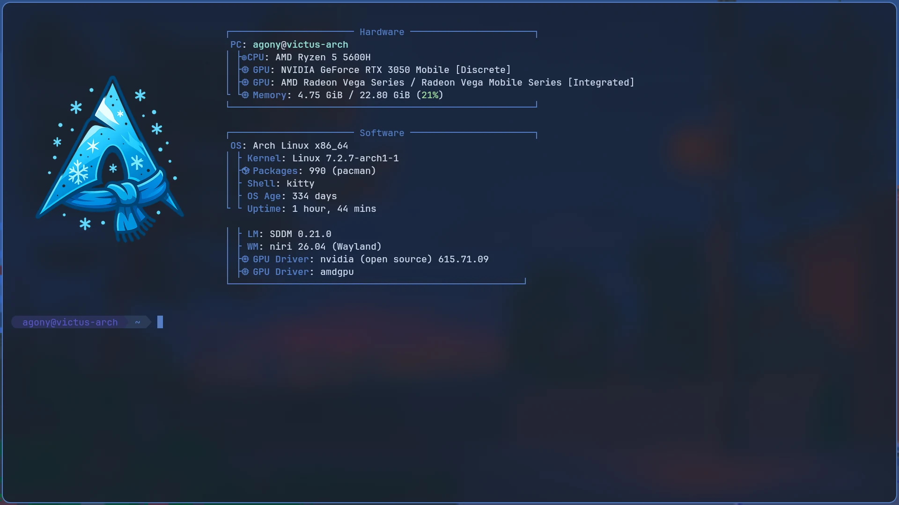

</div>

## Themes

Press **Mod+Shift+T**, pick a wallpaper, and [themely](https://github.com/noturbob/themely) pulls an accent from it and recolours
everything: window borders, the terminal and prompt, the bar, notifications, the launcher, browsers, editors, Discord
and Spotify. Five themes ship in `themely/themes/`.

<table>
  <tr>
    <td width="50%">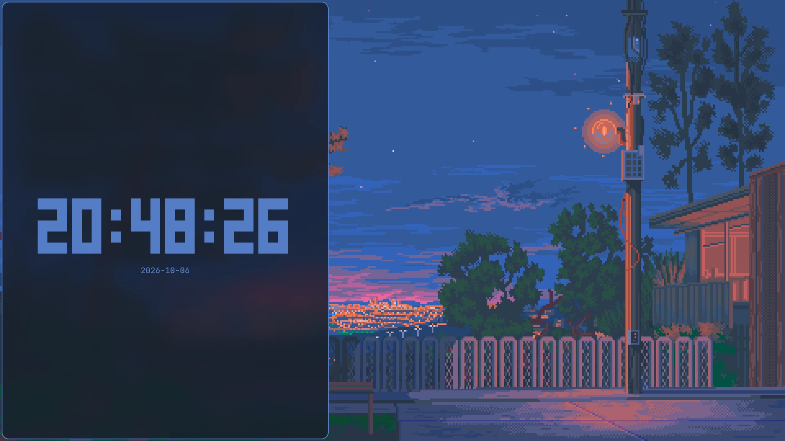<p align="center"><b>Benched Feelings</b> <code>#547dc5</code></p></td>
    <td width="50%">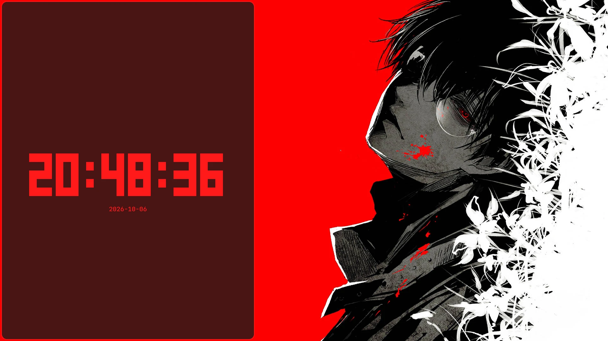<p align="center"><b>Death Bloom</b> <code>#ff1a1b</code></p></td>
  </tr>
  <tr>
    <td width="50%">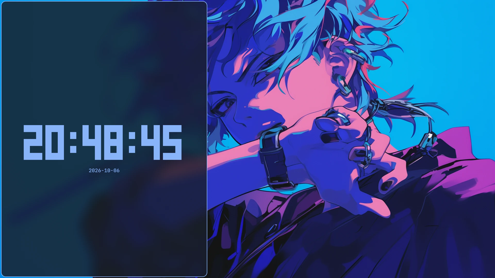<p align="center"><b>Mocha Blue</b> <code>#89b4fa</code></p></td>
    <td width="50%">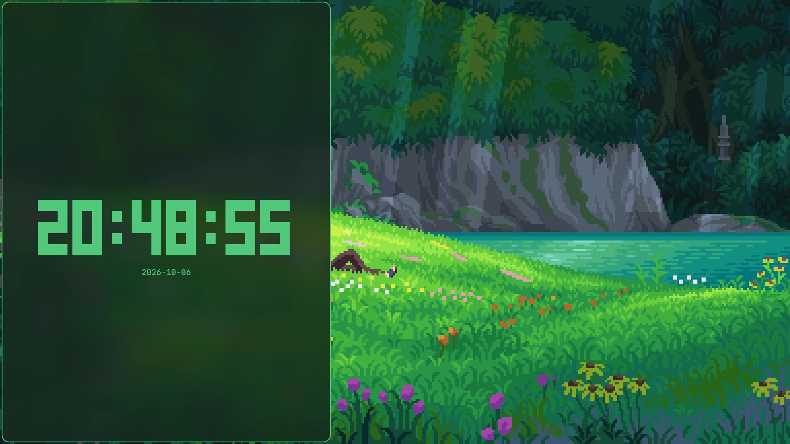<p align="center"><b>Nebula</b> <code>#50c87c</code></p></td>
  </tr>
  <tr>
    <td width="50%">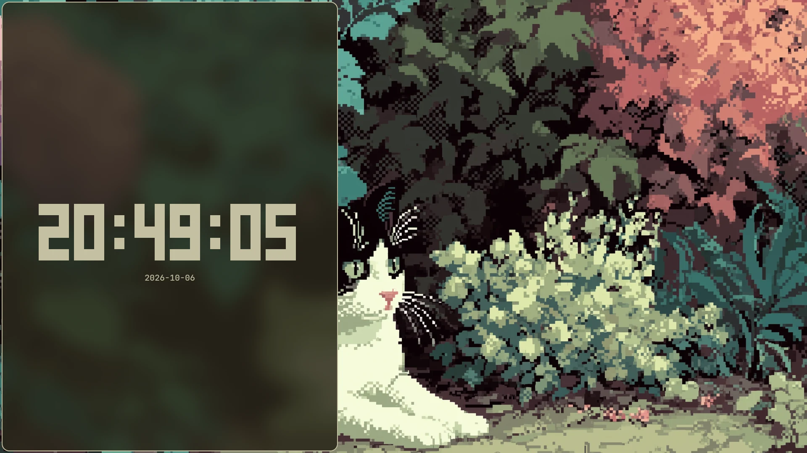<p align="center"><b>Whiskers</b> <code>#c4c0a2</code></p></td>
    <td width="50%" valign="middle">
      <p>Every theme is a wallpaper plus an accent. Make your own with<br><code>themely save --name "Name" --wallpaper image.jpg</code></p>
      <p>The configs here hold <code>&gt;&gt;&gt; themely … &lt;&lt;&lt; themely</code> marker blocks. themely rewrites only the lines between them, so everything outside is hand-written.</p>
    </td>
  </tr>
</table>

## A tour

### Tiling, the niri way

Scrollable columns instead of a fixed grid: windows open to the right, and the strip scrolls. Every window shares one
opacity and blurs what's behind it.

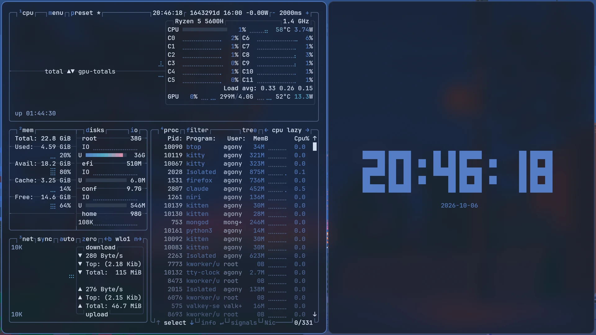

### slat

[slat](https://github.com/noturbob/slat), my own terminal multiplexer: splits, tabs and a status line, recoloured live by
themely. It's scriptable too: `slat pane new --split v --cmd htop` built this layout.

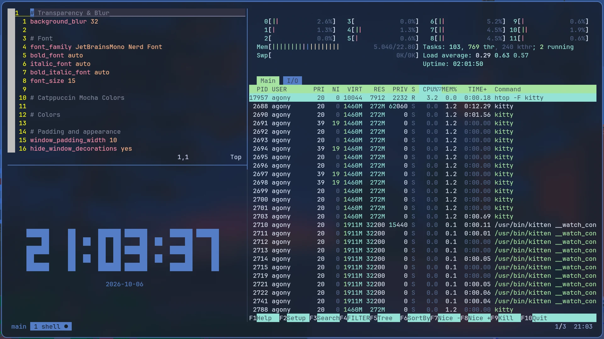

### VS Code

The Catppuccin theme with themely's colours on top, so the editor follows the wallpaper like everything else.

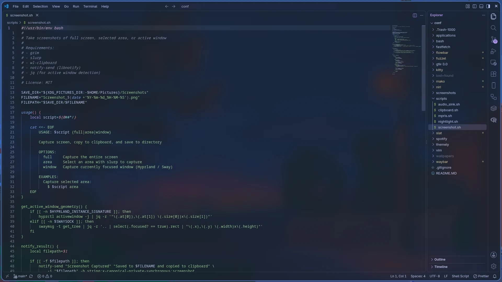

### Spotify

Spicetify brings Spotify into the theme too.

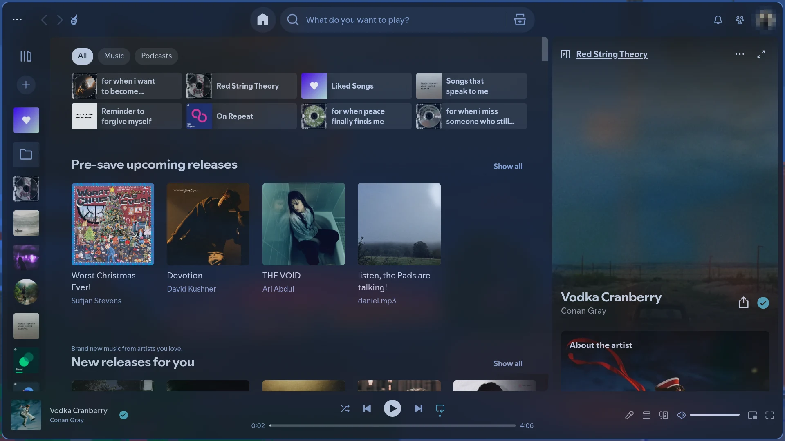

### Zen, edge to edge

Zen in compact mode, so the page runs to the window's edge. Pywalfox keeps Zen and Firefox on the current theme.

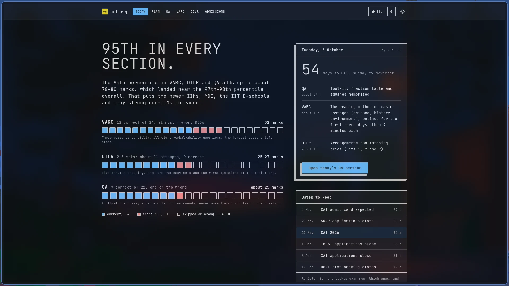

### Launcher

`fuzzel` on **Mod+D**, recoloured with everything else.

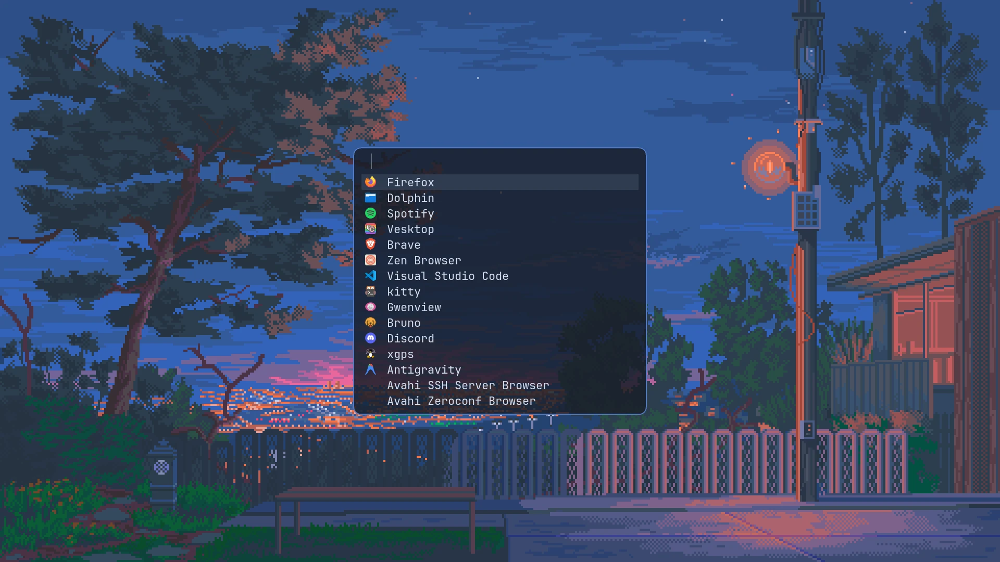

### Files

Dolphin, translucent like every other window, with GTK and KDE apps following the theme.

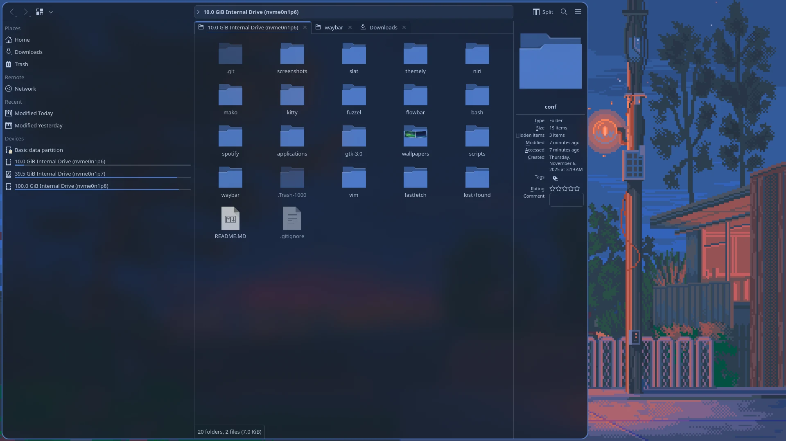

### Bar and notifications

[flowbar](https://github.com/noturbob/Flowbar), my own GTK4 bar, slides in on **Mod+Slash**, and peeks on its own when you change
the volume or brightness. Notifications are `mako`.

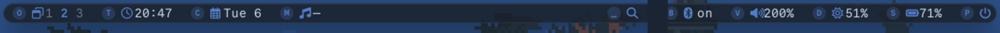

<p align="center">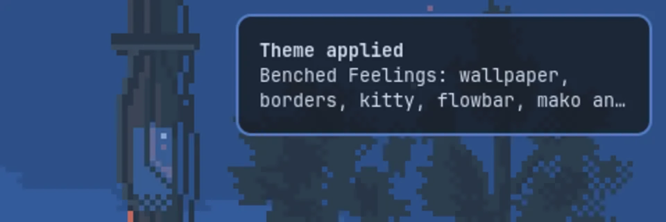</p>

## What's inside

| | |
|---|---|
| **Window manager** | `niri`: scrollable tiling, rounded corners, one opacity and blur for every window |
| **Bar** | [`flowbar`](https://github.com/noturbob/Flowbar), my own GTK4 bar. `waybar/` is kept as the previous setup |
| **Theme switcher** | [`themely`](https://github.com/noturbob/themely): wallpaper → accent → every app, with a circular reveal |
| **Terminal** | `kitty`, translucent, with a powerline bash prompt that follows the theme |
| **Multiplexer** | [`slat`](https://github.com/noturbob/slat), my own, recoloured live by themely |
| **Launcher** | `fuzzel` |
| **Notifications** | `mako` |
| **Shell** | `bash` (`bash/.bashrc`) |
| **System info** | `fastfetch` |
| **Editor** | `vim` |
| **Extras** | `gtk-3.0`, `scripts/` (audio sink, clipboard, media, night light, screenshots), Spotify Wayland flags, a VLC launcher override |

themely also reaches VS Code and Antigravity, Vesktop, GTK and KDE apps, Firefox and Zen (Pywalfox), btop, slat and
Spotify (spicetify), mostly live.

## Keybinds

| Keys | Action |
|---|---|
| `Mod+Shift+T` | Theme switcher |
| `Mod+T` | kitty |
| `Mod+D` | fuzzel |
| `Mod+Slash` | Toggle flowbar |
| `Alt+F` / `Alt+D` / `Alt+S` | Firefox / Discord (Vesktop) / Spotify |
| `Super+Alt+L` | Lock (swaylock) |
| `Mod+O`, `Mod+Tab` | Overview |
| `Mod+Shift+/` | All hotkeys |

## Layout

The repo lives at `/conf`, and each config is symlinked into place:

| In this repo | Linked from |
|---|---|
| `niri/` | `~/.config/niri` |
| `flowbar/` | `~/.config/flowbar` |
| `mako/` | `~/.config/mako` |
| `gtk-3.0/` | `~/.config/gtk-3.0` |
| `themely/` | `~/.config/themely` |
| `kitty/kitty.conf` | `~/.config/kitty/kitty.conf` |
| `fuzzel/fuzzel.ini` | `~/.config/fuzzel/fuzzel.ini` |
| `slat/config.toml` | `~/.config/slat/config.toml` |
| `bash/.bashrc` | `~/.bashrc` |
| `spotify/spotify-flags.conf` | `~/.config/spotify-flags.conf` |
| `applications/vlc.desktop` | `~/.local/share/applications/vlc.desktop` |

## Setting it up on a fresh install

```sh
sudo git clone https://github.com/noturbob/Arch-Linux-Dotfiles /conf && sudo chown -R "$USER": /conf

# packages
sudo pacman -S niri kitty fuzzel mako swaybg swaylock fastfetch quickshell \
               python-gobject imagemagick plasma-integration qt5ct
uv tool install pywalfox          # Firefox/Zen theming
yay -S spicetify-cli              # Spotify theming

# links
for d in niri flowbar mako gtk-3.0 themely; do ln -sfn /conf/$d ~/.config/$d; done
mkdir -p ~/.config/kitty ~/.config/fuzzel ~/.config/slat ~/.local/share/applications
ln -sf /conf/kitty/kitty.conf           ~/.config/kitty/kitty.conf
ln -sf /conf/fuzzel/fuzzel.ini          ~/.config/fuzzel/fuzzel.ini
ln -sf /conf/slat/config.toml           ~/.config/slat/config.toml
ln -sf /conf/bash/.bashrc               ~/.bashrc
ln -sf /conf/spotify/spotify-flags.conf ~/.config/spotify-flags.conf
ln -sf /conf/applications/vlc.desktop   ~/.local/share/applications/vlc.desktop
```

Then install [flowbar](https://github.com/noturbob/Flowbar) and [themely](https://github.com/noturbob/themely) by following their
READMEs. The themely README also covers the one-time steps for Vesktop, Pywalfox and spicetify.

**Wallpapers aren't committed** (`wallpapers/` and the theme wallpapers are gitignored). After cloning, put each theme's
image back:

```sh
cp ~/Pictures/some-wall.jpg /conf/themely/themes/nebula/wallpaper
themely apply nebula
```

<p align="center"><sub>Wallpapers belong to their artists. Screenshots taken on niri with grim.</sub></p>
